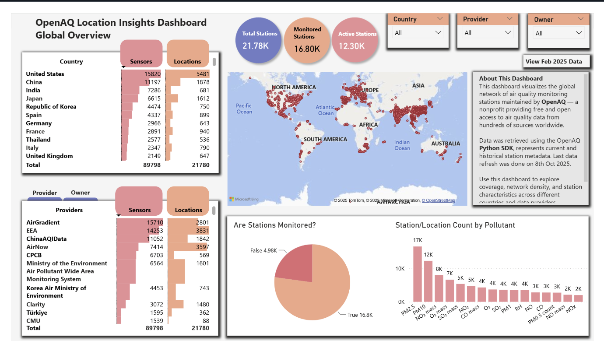
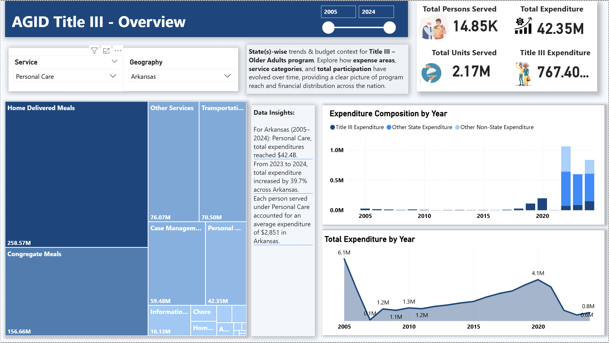

# 📊 Power BI Dashboard Collection

Welcome to my **Power BI Dashboard Repository** — a collection of interactive dashboards I’ve designed, developed, and published to showcase data insights across different domains.

Each dashboard lives in its own folder under the project root, containing:
- The **Power BI file (`.pbix`)**
- A **PDF export** (for quick viewing)

---

## 🚀 Current Dashboards

### 1️⃣ **OpenAQ Location Insight**
**Status:** ✅ Completed  
**Description:**  
This dashboard visualizes the global network of air quality monitoring stations maintained by OpenAQ — a nonprofit providing free and open access to air quality data from hundreds of sources worldwide.

Data was retrieved using the OpenAQ Python SDK, represents current and historical station metadata. Last data refresh was done on 8th Oct 2025.

**Preview:**

- [📄 View PDF Export](https://github.com/Arnav-Ajay/Dashboards/blob/main/OpenAQ%20-%20Location%20Insight/OpenAQ%20Location%20Insight.pdf)
- [View Project](https://github.com/Arnav-Ajay/Dashboards/tree/main/OpenAQ%20-%20Location%20Insight)
---

### 1️⃣ **AGID - Title III Dashboard**
**Status:** Ongoing  
**Description:**  
A Power BI dashboard built to explore national trends in services and expenditures under the Administration for Community Living’s (ACL) Title III Programs.

This dashboard focuses on Older Adults (Age 60+), analyzing Persons Served, Units Delivered, and Expenditures across the United States. Data represents roughly 25% of the full Title III dataset, emphasizing services like Personal Care, Homemaker, Chore, and Home-Delivered Meals.

Data was accessed through AWS Athena and modeled using metadata-driven design to support semantic filtering and service-level exploration.

**Preview:**

- [📄 View PDF Export](https://github.com/Arnav-Ajay/Dashboards/blob/main/AGID%20-%20Title%20III%20SPR/Title%20III%20Older%20Adults.pdf)
- [View Project](https://github.com/Arnav-Ajay/Dashboards/tree/main/AGID%20-%20Title%20III%20SPR)
---

## 🧠 Future Plans
I’ll continue expanding this repository with additional dashboards covering:
- Environmental and air quality metrics  
- Independent Living Services data visualizations  
- Funding trends and outcome correlations  

Each dashboard will include:
- A **Power BI `.pbix`** file  
- A **PDF export**

Note: datasets are too big for github, hence skipped.

---

## 🧾 License
This project is shared for educational and portfolio purposes.  
Please credit the author if you reference or reuse any materials.

---

## 👨‍💻 Author
**Arnav Ajay**  
💼 [LinkedIn Profile]( https://www.linkedin.com/in/arnav-ajay/ )  
